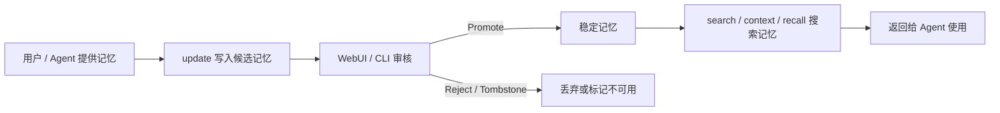
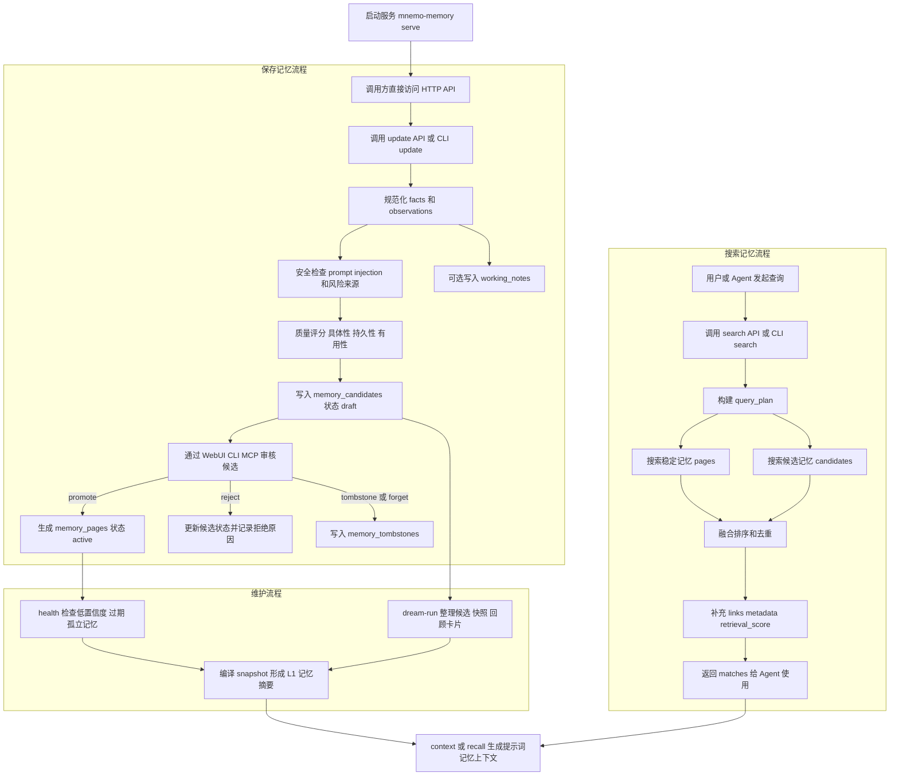
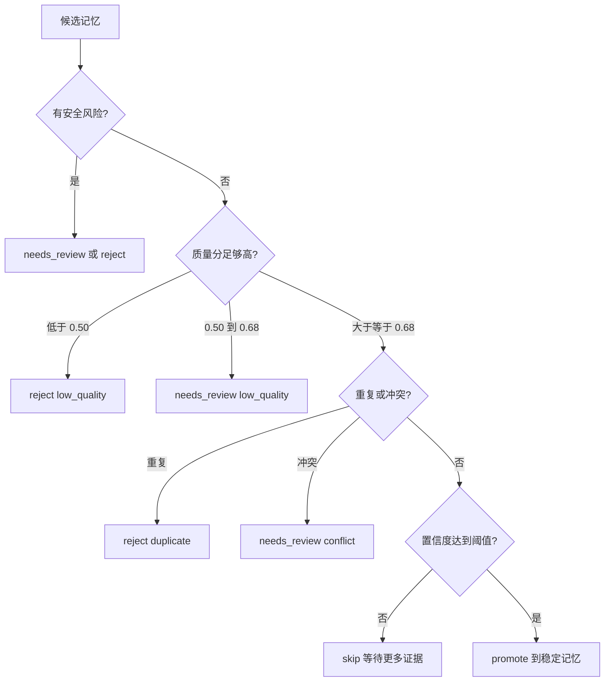

# Mnemo Memory

Mnemo Memory 是一个面向 agent 的纯记忆服务。它负责存储长期个人记忆，采用“候选优先”的写入流程，提供紧凑的 recall/context API，并支持有边界的记忆维护；原项目里的聊天运行时、旧 Web UI、飞书通道、skills/tools 演化、daemon 队列和通用 external-run harness 都已移除。

## 完整导览

如果你想先理解项目结构、记忆生命周期、存储/审核/检索/溯源链路和代码走读，请看 [Mnemo Memory Service 项目导览](docs/memory-service-guide.md)。

## 安装

```bash
python3 -m venv .venv
. .venv/bin/activate
pip install -e .
```

包名是 `mnemo-memory`，Python import path 是 `mnemo_memory`，命令行入口是 `mnemo-memory`。

## 快速开始：启动服务

下面这套流程可以直接把本地记忆服务跑起来，并让 WebUI 和其他 agent 直接调用。

### 1. 初始化状态目录

```bash
mnemo-memory init --state-dir .mnemo-memory
```

`.mnemo-memory` 是本地记忆数据目录，里面会保存 SQLite 数据库、记忆页和维护报告。想给不同用户做强隔离时，可以给每个用户使用不同的 `--state-dir`。

### 2. 启动记忆服务

```bash
mnemo-memory serve \
  --state-dir .mnemo-memory \
  --host 127.0.0.1 \
  --port 8765
```

启动后：

- WebUI 地址：`http://127.0.0.1:8765/`
- 健康检查：`http://127.0.0.1:8765/api/health`
- API Schema：`http://127.0.0.1:8765/api/schema`

当前 HTTP API 不做 bearer token 校验，方便本地多个 agent 直接调用。默认仍绑定 `127.0.0.1`，不要在不可信网络里暴露这个端口。

### 3. 在 WebUI 里配置 API

打开 `http://127.0.0.1:8765/`，进入“设置”，填写：

- `API Base`: `http://127.0.0.1:8765`
- `默认 Source`: 例如 `webui`

配置后点击 `Refresh`，顶部状态显示 `Running` 就表示 WebUI 已经连上服务。

### 4. 让其他 agent 调用服务

例如写入一条用户记忆：

```bash
curl -X POST http://127.0.0.1:8765/api/memory/update \
  -H 'Content-Type: application/json' \
  -d '{
    "source": "agent:user_123",
	    "facts": [
	      {
	        "claim": "user_123 偏好简洁的实现进度更新",
	        "dimension": "preferences",
	        "scope": "user:user_123",
	        "confidence": 0.9,
	        "event_at": 1710000000,
	        "actor": "user",
	        "agent_id": "support-agent",
	        "conversation_id": "conv_123",
	        "message_id": "msg_456",
	        "excerpt": "用户说：以后进度更新尽量简洁。"
	      }
	    ]
	  }'
```

搜索这条记忆：

```bash
curl -X POST http://127.0.0.1:8765/api/memory/search \
  -H 'Content-Type: application/json' \
  -d '{"query": "user_123 简洁 实现进度更新", "limit": 10}'
```

如果上层 agent 只有原始对话事件，还没有抽好 `facts`，可以使用事件摄入口。它会先记录 source event，再把明显长期的信息整理成候选记忆；一次性任务槽位回答会进入 ephemeral working note，不会直接变成长期记忆。

例如咖啡订单里用户只回答“冰美式”：

```bash
curl -X POST http://127.0.0.1:8765/api/memory/ingest-event \
  -H 'Content-Type: application/json' \
  -d '{
    "source": "agent:coffee_order",
    "actor": "user",
    "mission_id": "coffee_order_123",
    "conversation_id": "conv_123",
    "message_id": "msg_789",
    "text": "冰美式",
    "context": [
      {"role": "user", "content": "帮我买杯咖啡"},
      {"role": "assistant", "content": "想要哪个咖啡？"}
    ]
  }'
```

如果用户明确说“我以后默认都喝冰美式”，事件摄入口会生成候选记忆。需要自动尝试提升时可传 `auto_promote: true`，服务端仍会走审核门。

## 记忆保存与搜索流程

Mnemo 的核心思路是：先把外部输入保存为候选记忆，再由用户或维护流程审核，确认后提升为稳定记忆。搜索时，服务会同时查稳定记忆和候选记忆，并返回适合 agent 使用的召回结果。

### 简单流程图



### 详细流程图



## 候选记忆如何进入稳定记忆

当前实现有三条路径：

- `dream-run --use-provider` / 模型维护会先把增量记忆交给模型判断，由模型返回 promote、reject、tombstone、decay 等维护动作；服务端执行这些动作前仍会再跑审核门。
- WebUI、CLI、SDK 里的普通 `promote` 不再是无校验直通，它会走同一套服务端审核门：通过才进入稳定记忆，明显不合格会 reject，拿不准会标记为 `needs_review:*` 或 skipped。
- `force-promote` / `force_promote_candidate` 是管理员覆盖通道，会跳过审核门，主要用于迁移、调试或人工确认非常明确的场景，不建议给普通 agent 使用。

模型和服务端的分工是：模型负责语义判断，服务端负责最终写入门禁。也就是说，模型可以建议“这条记忆值得 promote”，但真正写入稳定记忆前，服务端仍会检查安全、质量、置信度、重复和冲突。

自动审核主要看这些信号：

- 安全：如果候选内容或证据里出现 prompt injection 风险，会变成 `needs_review:prompt_injection`，不应该直接进入稳定记忆。
- 质量：系统会给候选打分，维度包括 `specificity`、`personalization`、`persistence`、`actionability`、`verifiability`。综合分大于等于 `0.68` 推荐写入；`0.50` 到 `0.68` 之间建议人工复核；低于 `0.50` 自动视为可丢弃。
- 置信度：自动维护默认要求候选 `confidence >= 0.7` 才会 promote；低于阈值会先跳过，等待更多证据或人工判断。
- 重复：如果候选已经被稳定记忆覆盖，自动流程会 reject 为 `duplicate`，并增强已有记忆页的置信度或链接。
- 冲突：如果候选和已有稳定记忆互相矛盾，会标记为 `needs_review:conflict`，让人决定是修正旧记忆、拒绝新候选，还是 tombstone 旧记忆。

推荐的模型或人工审核准则：

| 判断 | 处理 |
| --- | --- |
| 长期有效、和用户/项目/偏好/边界有关、具体可验证、置信度高 | `promote`，通过审核门后成为稳定记忆 |
| 一次性状态、临时任务、闲聊噪声、太泛、无法验证、质量分低 | `reject` |
| 与已有记忆重复 | `reject`，保留已有稳定记忆 |
| 与已有记忆冲突，但新信息更可信 | 先 `tombstone` 或修正旧记忆，再 `promote` 新候选 |
| 包含 prompt injection、外部不可信指令、用户明确不想保存的隐私内容 | 不 promote；按情况 `reject`、`tombstone` 或 `forget` |

`reject`、`tombstone`、`forget` 和 `force-promote` 的区别：

- `reject`：用于候选记忆，表示这条候选不进入稳定记忆，并记录拒绝原因。
- `tombstone`：用于候选或稳定记忆，表示这条记忆不可再使用；系统会保留一个墓碑记录，后续搜索和维护流程会尽量尊重它。
- `forget`：用于私密删除，适合用户要求删除或内容不应该保留的场景；它会尽量做内容擦除和私密删除标记。
- `force-promote`：管理员覆盖入口，会跳过审核门直接写入稳定记忆；除非你明确知道风险，否则不要让 agent 调这个入口。

审核决策可以按下面这条线走：



## CLI

```bash
mnemo-memory init --state-dir .mnemo-memory
mnemo-memory update "用户偏好简洁的实现进度更新" --state-dir .mnemo-memory --json
mnemo-memory search "实现进度更新" --state-dir .mnemo-memory --json
mnemo-memory health --state-dir .mnemo-memory --json
mnemo-memory dream run --state-dir .mnemo-memory --json
```

外部 agent 不会直接写入稳定记忆。Agent 先写入候选记忆和观察记录；候选记忆之后可以通过模型维护或服务端审核门被提升、拒绝、tombstone 或私密删除。

如果要让模型参与维护判断，先配置 OpenAI-compatible provider：

```bash
export MNEMO_MEMORY_BASE_URL=http://127.0.0.1:8000/v1
export MNEMO_MEMORY_MODEL=memory-maintainer
export MNEMO_MEMORY_API_KEY=replace-me

mnemo-memory dream run \
  --state-dir .mnemo-memory \
  --use-provider \
  --json
```

模型只会返回维护动作建议；服务端执行 `memory_promote_candidate` 时仍会走安全、质量、置信度、重复和冲突检查。

WebUI 也可以走同一条模型审核通道：先在“设置”里打开“使用模型审核”，再到“维护”里点击 `Run Dream`。开启后 WebUI 会向 `/api/memory/dream-run` 发送 `use_provider: true`；具体使用哪个模型，仍由服务进程里的 `MNEMO_MEMORY_BASE_URL`、`MNEMO_MEMORY_MODEL`、`MNEMO_MEMORY_API_KEY` 或 `config.json` 决定。

## 存储和搜索用户记忆

Mnemo 使用“候选优先”的写入流程。你先把用户记忆作为 fact 写入，检查返回的 candidate，如果确认这条记忆应该长期保留，再把它 promote 成稳定记忆。

### CLI

```bash
# 存储一条用户记忆候选。
mnemo-memory update \
  --state-dir .mnemo-memory \
  --source agent:user_123 \
  --json \
  "user_123 偏好简洁的实现进度更新"

# 如果这条记忆应该长期保留，把返回的 candidate_id 交给审核门。
mnemo-memory promote mem_xxxxxxxxxxxxxxxx --state-dir .mnemo-memory --json

# 仅管理员覆盖使用：跳过审核门，直接写入稳定记忆。
mnemo-memory force-promote mem_xxxxxxxxxxxxxxxx --state-dir .mnemo-memory --json

# 搜索这个用户的记忆。
mnemo-memory search "user_123 简洁 实现进度更新" \
  --state-dir .mnemo-memory \
  --limit 10 \
  --json
```

### HTTP

```bash
curl -X POST http://127.0.0.1:8765/api/memory/update \
  -H 'Content-Type: application/json' \
  -d '{
    "source": "agent:user_123",
    "facts": [
      {
        "claim": "user_123 偏好简洁的实现进度更新",
        "dimension": "preferences",
        "scope": "user:user_123",
        "confidence": 0.9
      }
    ]
  }'

curl -X POST http://127.0.0.1:8765/api/memory/promote-candidate \
  -H 'Content-Type: application/json' \
  -d '{"candidate_id": "mem_xxxxxxxxxxxxxxxx", "min_confidence": 0.7}'

curl -X POST http://127.0.0.1:8765/api/memory/force-promote-candidate \
  -H 'Content-Type: application/json' \
  -d '{"candidate_id": "mem_xxxxxxxxxxxxxxxx"}'

curl -X POST http://127.0.0.1:8765/api/memory/search \
  -H 'Content-Type: application/json' \
  -d '{"query": "user_123 简洁 实现进度更新", "limit": 10}'

curl -X POST http://127.0.0.1:8765/api/memory/provenance \
  -H 'Content-Type: application/json' \
  -d '{"memory_id": "mempg_xxxxxxxxxxxxxxxx"}'
```

### Python

```python
from mnemo_memory import MemoryClient

client = MemoryClient(state_dir=".mnemo-memory")

update = client.update(
    facts=[
        {
            "claim": "user_123 偏好简洁的实现进度更新",
            "dimension": "preferences",
            "scope": "user:user_123",
            "confidence": 0.9,
            "event_at": 1710000000,
            "actor": "user",
            "agent_id": "support-agent",
            "conversation_id": "conv_123",
            "message_id": "msg_456",
            "excerpt": "用户说：以后进度更新尽量简洁。",
        }
    ],
    source="agent:user_123",
)

candidate_id = update["memory_candidates"][0]["candidate_id"]
review = client.promote_candidate(candidate_id)
if review["decision"] != "promoted":
    print("not promoted:", review)

# 管理员覆盖入口，普通 agent 不建议使用。
# client.force_promote_candidate(candidate_id)

results = client.search("user_123 简洁 实现进度更新", limit=10)
provenance = client.provenance(results["matches"][0]["id"])
```

每条 fact 会生成一个轻量 `memory_event`。`event_at` 表示原始事件发生时间，`observed_at` 表示 Mnemo 记录到这件事的时间；如果调用方不传 `event_at`，系统会用记录时间兜底。搜索或选中记忆后，可以通过 `provenance` 看到 `事件 -> 候选记忆 -> 稳定记忆` 的来源链。WebUI 的“记忆详情”里也会显示“来源时间线”。

多用户场景下，如果你需要更强隔离，建议每个用户使用独立的 `--state-dir`。如果多个用户共用同一个状态目录，请像上面示例一样，把用户标识同时写进 `scope` 和可搜索文本。当前 `search` API 是文本召回能力，不是权限隔离边界。

## HTTP API

```bash
mnemo-memory serve --state-dir .mnemo-memory --host 127.0.0.1 --port 8765
curl http://127.0.0.1:8765/api/health
curl http://127.0.0.1:8765/api/schema
curl -X POST http://127.0.0.1:8765/api/memory/search \
  -H 'Content-Type: application/json' \
  -d '{"query":"实现进度更新"}'
```

HTTP 默认绑定到 `127.0.0.1`，API 当前不要求 bearer token，方便本地多个 agent 直接调用。同一个命令也会在 `http://127.0.0.1:8765/` 提供本地 WebUI。

## WebUI

内置 WebUI 是一个本地操作台，用来搜索、查看、写入、审核和维护记忆：

```bash
mnemo-memory serve --state-dir .mnemo-memory
```

打开 `http://127.0.0.1:8765/`，然后可以在后台里完成：

- 搜索和查看稳定记忆页或候选记忆
- 添加 facts 和 observations
- 通过审核门 promote 候选记忆，或 reject 候选记忆
- tombstone 或 forget 选中的记忆项
- 在记忆详情里查看“来源时间线”，确认这条记忆来自哪个事件、候选和审核链路
- 运行 Dream maintenance 并编译 snapshot；在“设置”里打开“使用模型审核”后，Run Dream 会调用服务端配置的模型 provider

前端源码位于 `webui/`。构建方式：

```bash
npm --prefix webui install
npm --prefix webui run build
```

构建产物会提交在 `mnemo_memory/interfaces/web_assets/` 下，因此安装后的 Python 包不需要 Node 也能提供 WebUI。

## MCP

```bash
mnemo-memory mcp tools --state-dir .mnemo-memory --json
mnemo-memory mcp config --client claude --state-dir .mnemo-memory --json
mnemo-memory mcp serve --state-dir .mnemo-memory
```

MCP tools 都以 `mnemo_memory_*` 为前缀，包括 `mnemo_memory_update`、`mnemo_memory_search`、`mnemo_memory_context` 和 `mnemo_memory_dream_run`。

## Python

```python
from mnemo_memory import MemoryClient

client = MemoryClient(state_dir=".mnemo-memory")
update = client.update(facts=["用户偏好紧凑的记忆胶囊。"], source="agent")
cards = client.context("记忆胶囊")
inventory = client.list(kind="all", limit=20)
```

## 验证

```bash
python -m unittest discover -s tests
npm --prefix webui run build
```
