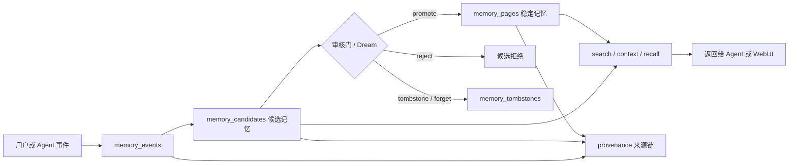
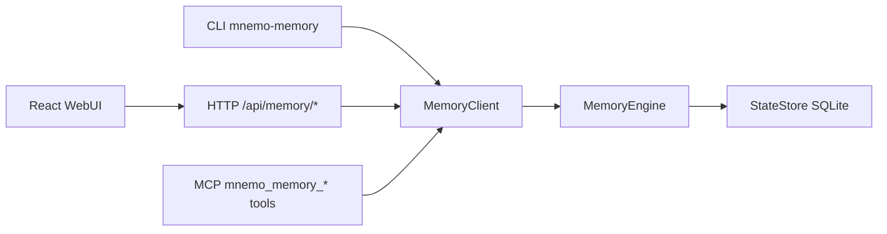
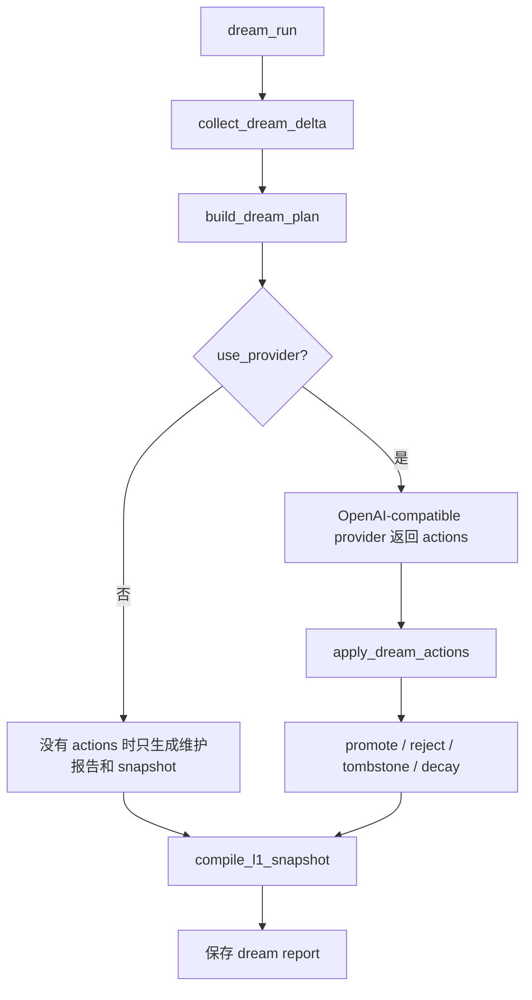

# Mnemo Memory Service 项目导览

这份文档面向第一次打开仓库的人。目标是让你快速理解三件事：

- 这个项目现在是什么：一个本地优先、轻量、纯记忆服务。
- 代码如何组织：从 CLI、HTTP、MCP、SDK 到存储和 WebUI 各自负责什么。
- 一条记忆如何流动：从用户事件写入，到候选审核、稳定记忆、维护、检索和溯源。

如果只想跑起来，先看 README 的“快速开始”。如果想理解原理和改代码，从本文开始。

## 一句话心智模型

Mnemo Memory 不是聊天机器人，也不是完整 agent runtime。它只负责一件事：把外部 agent 提供的用户事实、偏好、边界、项目上下文等内容，整理成可搜索、可维护、可溯源的长期记忆。

核心原则是“候选优先”：

1. 外部 agent 不直接写稳定记忆。
2. `update` 先写入 `memory_events` 和 `memory_candidates`。
3. 审核门或 Dream 维护决定候选是否进入 `memory_pages`。
4. `search`、`context`、`recall` 从稳定记忆和候选中召回内容。
5. `provenance` 可以追溯一条记忆来自哪个事件和候选。



## 项目结构

当前 Python 包名是 `mnemo-memory`，import path 是 `mnemo_memory`，命令行入口是 `mnemo-memory`。

```text
.
├── mnemo_memory/
│   ├── __init__.py
│   ├── __main__.py
│   ├── core/
│   │   ├── config.py          # state-dir、provider、模型和 token 配置解析
│   │   ├── ids.py             # mem_ / mempg_ / mevt_ 等 ID 生成
│   │   ├── injection.py       # prompt injection 风险检测基础函数
│   │   └── jsonutil.py        # JSON dumps/loads 辅助
│   ├── interfaces/
│   │   ├── cli.py             # mnemo-memory 命令行入口
│   │   ├── web.py             # stdlib HTTP server + /api/* + WebUI 静态资源
│   │   └── web_assets/        # Vite 构建产物，安装后无需 Node 也能打开 WebUI
│   ├── mcp/
│   │   └── server.py          # MCP stdio 工具协议
│   ├── memory/
│   │   ├── engine.py          # 组合多个 mixin，形成 MemoryEngine
│   │   ├── learning.py        # 写候选、审核、promote、reject、重复/冲突判断
│   │   ├── recall.py          # search/context/recall 检索逻辑
│   │   ├── dream.py           # Dream 维护、模型建议、维护报告
│   │   ├── health.py          # 记忆健康检查
│   │   ├── curation.py        # tombstone、forget、私密删除
│   │   ├── quality.py         # 质量评分
│   │   ├── safety.py          # 安全和来源风险扫描
│   │   ├── query.py           # query plan、检索路由、融合排序
│   │   ├── snapshot.py        # L1 snapshot 编译
│   │   └── wiki.py            # 稳定记忆页物化到 wiki 文件
│   ├── providers/
│   │   └── openai.py          # OpenAI-compatible Dream 维护 provider
│   ├── sdk/
│   │   ├── client.py          # MemoryClient，主要 Python API
│   │   └── schema.py          # 对外 API schema
│   └── storage/
│       └── sqlite.py          # SQLite 表结构和读写方法
├── webui/
│   ├── src/main.tsx           # React WebUI 主逻辑
│   ├── src/styles.css         # WebUI 样式
│   └── vite.config.ts         # 构建输出到 mnemo_memory/interfaces/web_assets/
├── tests/
│   ├── test_memory_service.py # SDK/API/MCP/记忆链路测试
│   ├── test_web_service.py    # Web server、静态资源、认证测试
│   └── test_package_install_smoke.py
├── pyproject.toml             # 包配置、console script、package-data
└── README.md                  # 快速开始、命令、API 示例
```

## 运行时数据目录

启动时通过 `--state-dir` 指定状态目录，例如 `.mnemo-memory`。

```text
.mnemo-memory/
├── state.db                  # SQLite 主数据库
├── config.json               # 可选，provider/model/token 配置
├── wiki/
│   ├── *.md                  # 稳定记忆页物化文件
│   └── l1-snapshot.json      # L1 记忆快照
└── runs/
    └── dream-reports/        # Dream 维护报告
```

不同用户需要强隔离时，建议每个用户一个 `state-dir`。如果多个用户共用同一个 state-dir，请把用户 ID 写进 `scope` 和可搜索文本，例如 `scope: "user:user_123"`，因为当前 `search` 是召回能力，不是权限隔离边界。

## 核心数据模型

表结构在 `mnemo_memory/storage/sqlite.py` 的 `StateStore.initialize()`。

| 表 | 作用 | 关键字段 |
| --- | --- | --- |
| `memory_events` | 原始来源事件，支持溯源 | `id`, `event_at`, `observed_at`, `source`, `agent_id`, `run_id`, `mission_id`, `conversation_id`, `message_id`, `actor`, `excerpt`, `raw_hash` |
| `memory_candidates` | 候选记忆，不一定会长期保存 | `id`, `run_id`, `claim`, `dimension`, `scope`, `confidence`, `evidence_json`, `status`, `created_at` |
| `memory_pages` | 稳定记忆页，真正用于长期 recall | `id`, `title`, `content`, `scope`, `confidence`, `status`, `source_candidate_id`, `metadata_json`, `created_at`, `updated_at` |
| `memory_links` | 记忆图边 | `source_id`, `target_id`, `relation`, `weight`, `created_at` |
| `memory_tombstones` | 拒绝、删除、不可复活记录 | `target_id`, `target_type`, `target_hash`, `reason`, `summary`, `evidence_run_id` |
| `working_notes` | 临时观察或 W0 工作笔记 | `mission_id`, `run_id`, `content`, `metadata_json`, `status`, `result_json` |

几个常见状态：

- candidate: `draft`, `promoted`, `rejected:*`, `needs_review:*`
- page: `active`, `tombstoned:*`, `private_delete:*`
- tombstone rule: 默认 `do_not_resurrect`

## 对外接口层

项目有四种入口，但核心逻辑都汇聚到 `MemoryClient`。



### Python SDK

文件：`mnemo_memory/sdk/client.py`

常用方法：

- `update(facts, observations, source, run_id, mission_id)`
- `search(query, limit, scope, include_tombstoned)`
- `list(kind, status, limit)`
- `read(memory_id)`
- `links(memory_id)`
- `provenance(memory_id)`
- `promote_candidate(candidate_id, min_confidence)`
- `reject_candidate(candidate_id, reason)`
- `tombstone(memory_id, reason)`
- `forget(memory_id)`
- `dream_run(limit, min_confidence, use_provider)`

### HTTP API

文件：`mnemo_memory/interfaces/web.py`

HTTP server 使用 Python stdlib `ThreadingHTTPServer`，没有新增运行时依赖。

- `GET /`：WebUI
- `GET /assets/*`：Vite 静态资源
- `GET /api/health`：健康检查，公开
- `GET /api/schema`：API schema，公开
- `POST /api/memory/<method>`：记忆 API，公开

`dispatch_memory_api()` 把 HTTP method 名映射到 `MemoryClient` 方法，例如：

- `/api/memory/update` -> `client.update(...)`
- `/api/memory/search` -> `client.search(...)`
- `/api/memory/provenance` -> `client.provenance(...)`
- `/api/memory/dream-run` -> `client.dream_run(...)`

### MCP

文件：`mnemo_memory/mcp/server.py`

MCP 工具统一使用 `mnemo_memory_*` 前缀，例如：

- `mnemo_memory_update`
- `mnemo_memory_search`
- `mnemo_memory_context`
- `mnemo_memory_read`
- `mnemo_memory_provenance`
- `mnemo_memory_dream_run`

### WebUI

文件：`webui/src/main.tsx`

WebUI 是本地管理后台。它不绕过 API，所有记忆操作都通过 HTTP `/api/memory/*`：

- 搜索/列表：`search`, `list`
- 详情：`read`, `links`, `provenance`
- 写入：`update`
- 审核：`promote-candidate`, `reject-candidate`
- 维护：`dream-status`, `dream-run`, `snapshot`, `tombstones`
- 设置：API Base、默认 source、是否使用模型审核

## 一条记忆完整走一趟

下面用一个具体例子说明完整链路。

用户对某个 agent 说：

> 以后给我项目进度时，尽量简洁，直接说完成了什么和下一步。

Agent 希望保存成记忆：

```json
{
  "claim": "user_123 偏好简洁的项目进度更新，只需要完成内容和下一步。",
  "dimension": "preferences",
  "scope": "user:user_123",
  "confidence": 0.9,
  "event_at": 1710000000,
  "actor": "user",
  "agent_id": "support-agent",
  "conversation_id": "conv_123",
  "message_id": "msg_456",
  "excerpt": "以后给我项目进度时，尽量简洁，直接说完成了什么和下一步。"
}
```

### 第 1 步：HTTP 写入

```bash
curl -X POST http://127.0.0.1:8765/api/memory/update \
  -H "Content-Type: application/json" \
  -d '{
    "source": "agent:user_123",
    "run_id": "run_001",
    "mission_id": "mission_memory",
    "facts": [
      {
        "claim": "user_123 偏好简洁的项目进度更新，只需要完成内容和下一步。",
        "dimension": "preferences",
        "scope": "user:user_123",
        "confidence": 0.9,
        "event_at": 1710000000,
        "actor": "user",
        "agent_id": "support-agent",
        "conversation_id": "conv_123",
        "message_id": "msg_456",
        "excerpt": "以后给我项目进度时，尽量简洁，直接说完成了什么和下一步。"
      }
    ]
  }'
```

代码路径：

```text
HTTP POST /api/memory/update
-> mnemo_memory/interfaces/web.py::dispatch_memory_api()
-> mnemo_memory/sdk/client.py::MemoryClient.update()
-> mnemo_memory/storage/sqlite.py::StateStore.add_memory_event()
-> mnemo_memory/memory/learning.py::MemoryLearningMixin.write_candidate()
-> mnemo_memory/memory/safety.py::scan_memory_candidate()
-> mnemo_memory/memory/quality.py::score_memory_quality()
-> mnemo_memory/storage/sqlite.py::StateStore.add_memory_candidate()
```

实际发生的事情：

1. `dispatch_memory_api()` 解析 JSON，调用 `client.update(...)`。
2. `MemoryClient.update()` 为每条 fact 生成一个 `memory_event`。
3. `memory_event` 保存 `event_at`、`observed_at`、`source`、`run_id`、`conversation_id`、`message_id`、`excerpt`、`raw_hash`。
4. `MemoryClient.update()` 规范化 fact，得到 `claim`、`dimension`、`scope`、`confidence`。
5. `MemoryEngine.write_candidate()` 跑安全扫描和质量评分。
6. `StateStore.add_memory_candidate()` 写入 `memory_candidates`。
7. candidate 的 `evidence_json` 里带着 `event_id`，以后可溯源。

返回结果类似：

```json
{
  "kind": "memory_update",
  "run_id": "run_001",
  "mission_id": "mission_memory",
  "memory_candidates": [
    {
      "candidate_id": "mem_xxx",
      "event_id": "mevt_xxx",
      "status": "draft",
      "dimension": "preferences",
      "scope": "user:user_123"
    }
  ],
  "working_notes": [],
  "skipped": []
}
```

到这里，记忆还只是候选，不是稳定记忆。

### 第 2 步：审核候选

普通 promote：

```bash
curl -X POST http://127.0.0.1:8765/api/memory/promote-candidate \
  -H "Content-Type: application/json" \
  -d '{"candidate_id": "mem_xxx", "min_confidence": 0.7}'
```

代码路径：

```text
POST /api/memory/promote-candidate
-> dispatch_memory_api()
-> MemoryClient.promote_candidate()
-> MemoryEngine.promote_candidate()
-> MemoryLearningMixin.review_candidate_for_promotion()
-> MemoryLearningMixin._review_draft_candidate_for_promotion()
```

审核门判断：

1. 候选必须是 `draft`。
2. 空 claim 会被 reject。
3. 质量分低于阈值会 reject 或 `needs_review:low_quality`。
4. 与已有稳定记忆重复会 reject 为 `duplicate`，并可能强化已有 page。
5. 与已有稳定记忆冲突会标记 `needs_review:conflict`。
6. `confidence < min_confidence` 会 skipped。
7. 全部通过后才进入 `_promote_candidate_unchecked()`。

`force-promote` 会跳过审核门，只适合管理员覆盖，不建议暴露给普通 agent。

### 第 3 步：写入稳定记忆

通过审核后：

```text
MemoryLearningMixin._promote_candidate_unchecked()
-> _promotion_page_route()
-> _merged_page_content()
-> StateStore.upsert_memory_page()
-> StateStore.update_memory_candidate_status(..., "promoted")
-> StateStore.add_memory_link(candidate_id, page_id, "promoted_to")
-> memory/wiki.py::materialize_memory_page()
```

实际结果：

- 新建或更新 `memory_pages`。
- candidate 状态变成 `promoted`。
- 写入一条 `memory_links`：`candidate -> page`，relation 是 `promoted_to`。
- page metadata 记录 `source_candidate_ids`。
- 稳定记忆页会物化到 `state-dir/wiki/*.md`。

稳定记忆页示意：

```json
{
  "id": "mempg_xxx",
  "title": "preferences: 项目进度",
  "content": "- user_123 偏好简洁的项目进度更新，只需要完成内容和下一步。",
  "scope": "user:user_123",
  "confidence": 0.9,
  "status": "active",
  "source_candidate_id": "mem_xxx",
  "metadata": {
    "dimension": "preferences",
    "topic": "项目进度",
    "source_candidate_ids": ["mem_xxx"]
  }
}
```

### 第 4 步：搜索记忆

```bash
curl -X POST http://127.0.0.1:8765/api/memory/search \
  -H "Content-Type: application/json" \
  -d '{"query": "user_123 简洁 项目进度", "limit": 10}'
```

代码路径：

```text
POST /api/memory/search
-> dispatch_memory_api()
-> MemoryClient.search()
-> MemoryEngine.search_with_plan()
-> MemoryRecallMixin.plan_query()
-> memory/query.py::build_memory_query_plan()
-> MemoryRecallMixin._search_memory_routes()
-> StateStore.search_memory_pages()
-> StateStore.search_memory_candidates()
-> memory/query.py::fuse_ranked_batches()
```

当前搜索的基本策略：

1. `build_memory_query_plan()` 把用户 query 拆成 lexical、semantic、aliases、temporal 等路由。
2. 每条路由会搜索 active `memory_pages`。
3. 也会搜索 `memory_candidates`，所以未 promote 的候选也可能出现。
4. metadata alias 也会参与 page 搜索。
5. `fuse_ranked_batches()` 融合排序和去重。
6. 如果命中稳定 page，还会补充相关联 page。

当前实现是轻量 SQLite 文本召回，不是向量数据库。也就是说，它依赖 title/content/claim/scope 等可搜索文本；如果需要强语义搜索，未来可以在 `recall.py` 或 `query.py` 后面接 embedding index。

返回结果示意：

```json
{
  "kind": "memory_search",
  "query": "user_123 简洁 项目进度",
  "matches": [
    {
      "type": "page",
      "id": "mempg_xxx",
      "title": "preferences: 项目进度",
      "content": "- user_123 偏好简洁的项目进度更新，只需要完成内容和下一步。",
      "scope": "user:user_123",
      "confidence": 0.9,
      "status": "active",
      "source_candidate_id": "mem_xxx"
    }
  ]
}
```

### 第 5 步：读取详情、关联和来源链

搜索结果只告诉你命中了什么。选中某条记忆后，WebUI 会并行调用：

```text
read(memory_id)       # 记忆详情
links(memory_id)      # 图关系
provenance(memory_id) # 来源事件、候选、稳定页链路
```

HTTP 示例：

```bash
curl -X POST http://127.0.0.1:8765/api/memory/provenance \
  -H "Content-Type: application/json" \
  -d '{"memory_id": "mempg_xxx"}'
```

代码路径：

```text
POST /api/memory/provenance
-> dispatch_memory_api()
-> MemoryClient.provenance()
-> StateStore.get_memory_page()
-> _page_source_candidate_ids()
-> StateStore.get_memory_candidate()
-> _candidate_event_ids()
-> StateStore.list_memory_events()
```

返回结果示意：

```json
{
  "kind": "memory_provenance",
  "memory_id": "mempg_xxx",
  "memory_type": "page",
  "page": {
    "type": "page",
    "id": "mempg_xxx",
    "title": "preferences: 项目进度"
  },
  "candidates": [
    {
      "type": "candidate",
      "id": "mem_xxx",
      "claim": "user_123 偏好简洁的项目进度更新，只需要完成内容和下一步。",
      "status": "promoted",
      "evidence": [
        {
          "kind": "agent_memory_update",
          "event_id": "mevt_xxx",
          "run_id": "run_001",
          "message_id": "msg_456"
        }
      ]
    }
  ],
  "events": [
    {
      "id": "mevt_xxx",
      "event_at": 1710000000,
      "observed_at": 1780000000,
      "source": "agent:user_123",
      "agent_id": "support-agent",
      "run_id": "run_001",
      "mission_id": "mission_memory",
      "conversation_id": "conv_123",
      "message_id": "msg_456",
      "actor": "user",
      "excerpt": "以后给我项目进度时，尽量简洁，直接说完成了什么和下一步。",
      "raw_hash": "sha256:..."
    }
  ]
}
```

WebUI 的代码路径：

```text
webui/src/main.tsx::readMemory()
-> callMemory("read")
-> callMemory("links")
-> callMemory("provenance")
-> MemoryDetail
-> ProvenanceTimeline
```

所以用户在 WebUI 里点击一条记忆后，右侧“来源时间线”会显示：

```text
事件: 用户当时说了什么 / 哪次 conversation / 哪条 message
候选: 系统抽取出的 candidate claim / 状态 / 创建时间
稳定: 最终写入的 memory page / 更新时间
```

## observations 和 working notes

`update()` 支持两类输入：

- `facts`: 直接变成候选记忆。
- `observations`: 先写入 `working_notes`。

`facts` 适合调用方已经明确知道“这是一个可长期保存的候选记忆”。

`observations` 适合更弱、更临时的记录，例如“本轮任务中出现了一个可能有用的上下文”。当前 `MemoryClient.update()` 会把 observation 存成 W0 工作笔记，后续可由 Dream/维护流程决定是否整理成候选。

## Dream 维护如何工作

Dream 是有边界的后台维护流程，不是无限自主 agent。

主要代码在 `mnemo_memory/memory/dream.py`。



关键点：

- `collect_dream_delta()` 只收集 bounded delta：开放 working notes、draft/needs_review candidates、changed pages、tombstones、health cards。
- `build_dream_plan()` 告诉模型允许哪些工具和预算。
- `use_provider=True` 时，`OpenAICompatibleMemoryMaintainer` 调用 OpenAI-compatible `/chat/completions`。
- 模型只返回 actions；服务端执行 actions 时仍会走审核门。
- 没有 provider 或 actions 时，Dream 仍会生成报告、健康检查和 snapshot，但不会凭空 promote。

配置模型：

```bash
export MNEMO_MEMORY_BASE_URL=http://127.0.0.1:8000/v1
export MNEMO_MEMORY_MODEL=memory-maintainer
export MNEMO_MEMORY_API_KEY=replace-me

mnemo-memory dream run --state-dir .mnemo-memory --use-provider --json
```

WebUI 里打开“设置 -> 使用模型审核”，再点击“维护 -> Run Dream”，前端会向 `/api/memory/dream-run` 发送 `use_provider: true`。

## 质量、安全、重复和冲突如何影响 promote

普通 `promote_candidate()` 不会盲写稳定记忆。它会进入 `review_candidate_for_promotion()`。

### 安全扫描

文件：`mnemo_memory/memory/safety.py`

检查点：

- claim 和 evidence 是否包含 prompt injection 风险。
- evidence source 是 trusted、external 还是 unknown。
- 有注入风险时，candidate 会变成 `needs_review:prompt_injection`。

### 质量评分

文件：`mnemo_memory/memory/quality.py`

评分维度：

- `specificity`: 是否具体。
- `personalization`: 是否和用户、项目、偏好、目标、边界有关。
- `persistence`: 是否长期有效。
- `actionability`: 是否对 agent 后续行为有帮助。
- `verifiability`: 是否有来源证据、ID、run、message、url/path 等。

综合分：

- `>= 0.68`: 推荐写入。
- `0.50 - 0.68`: 建议保留候选或人工复核。
- `< 0.50`: 推荐丢弃。

### 重复和冲突

文件：`mnemo_memory/memory/learning.py`

审核门会：

- 查已有 page 是否已经包含相同或近似 claim。
- 重复时 reject 为 `duplicate`。
- 与已有稳定记忆冲突时标记 `needs_review:conflict`。
- 通过后才 `_promote_candidate_unchecked()`。

## WebUI 页面如何对应 API

| WebUI 区域 | 主要 API | 代码位置 |
| --- | --- | --- |
| 顶部状态栏 | `/api/health` | `refresh()` |
| 总览 | `health`, `dream-status`, `snapshot`, `tombstones`, `list` | `refresh()` |
| 搜索 | `search` | `searchMemory()` |
| 记忆详情 | `read`, `links`, `provenance` | `readMemory()` |
| 写入记忆 | `update` | `submitMemory()` |
| 候选审核 | `promote-candidate`, `reject-candidate` | `promoteCandidate()`, `rejectCandidate()` |
| 维护 | `dream-run`, `snapshot` | `runDream()`, `compileSnapshot()` |
| 设置 | localStorage | `apiBase`, `useProvider` state |

前端源码在 `webui/`，构建产物提交到 `mnemo_memory/interfaces/web_assets/`。因此安装 Python 包后不需要 Node 也能访问 WebUI。

构建命令：

```bash
npm --prefix webui install
npm --prefix webui run build
```

## 新用户上手路径

### 本地服务

```bash
python3 -m venv .venv
. .venv/bin/activate
pip install -e .

mnemo-memory init --state-dir .mnemo-memory
mnemo-memory serve --state-dir .mnemo-memory --host 127.0.0.1 --port 8765
```

打开：

```text
http://127.0.0.1:8765/
```

WebUI 设置：

- API Base: `http://127.0.0.1:8765`
- 默认 Source: `webui` 或你的 agent 名称

### Python 最小例子

```python
from mnemo_memory import MemoryClient

client = MemoryClient(state_dir=".mnemo-memory")

update = client.update(
    facts=[
        {
            "claim": "user_123 偏好简洁的项目进度更新，只需要完成内容和下一步。",
            "dimension": "preferences",
            "scope": "user:user_123",
            "confidence": 0.9,
            "event_at": 1710000000,
            "actor": "user",
            "agent_id": "support-agent",
            "conversation_id": "conv_123",
            "message_id": "msg_456",
            "excerpt": "以后给我项目进度时，尽量简洁，直接说完成了什么和下一步。",
        }
    ],
    source="agent:user_123",
    run_id="run_001",
    mission_id="mission_memory",
)

candidate_id = update["memory_candidates"][0]["candidate_id"]
review = client.promote_candidate(candidate_id)

search = client.search("user_123 简洁 项目进度", limit=5)
memory_id = search["matches"][0]["id"]
detail = client.read(memory_id)
provenance = client.provenance(memory_id)

print(detail)
print(provenance)
```

## 常见扩展点

### 想加新的 HTTP API

1. 在 `MemoryClient` 上加方法。
2. 在 `mnemo_memory/interfaces/web.py::dispatch_memory_api()` 加 method 分发。
3. 在 `mnemo_memory/sdk/schema.py` 加 schema 条目。
4. 如果 agent 也要用，在 `mnemo_memory/mcp/server.py` 加 MCP tool。
5. 加测试到 `tests/test_memory_service.py` 或 `tests/test_web_service.py`。

### 想改 promote 审核逻辑

主要改：

- `mnemo_memory/memory/learning.py`
- `mnemo_memory/memory/quality.py`
- `mnemo_memory/memory/safety.py`

优先补测试：

- 低质量候选是否 reject。
- 低置信度是否 skipped。
- 重复是否 reject duplicate。
- 冲突是否 needs_review。

### 想换成向量检索

当前文本搜索入口集中在：

- `mnemo_memory/memory/recall.py`
- `mnemo_memory/memory/query.py`
- `StateStore.search_memory_pages()`
- `StateStore.search_memory_candidates()`

可以保留 query plan 和结果格式，在 `_search_memory_routes()` 后面接 embedding index，再把结果交给 `fuse_ranked_batches()`。

### 想让模型更深度参与维护

主要入口：

- `mnemo_memory/memory/dream.py`
- `mnemo_memory/providers/openai.py`

保持边界：

- 模型只提 actions。
- 服务端执行 actions。
- promote 仍走审核门。
- `force_promote_candidate` 不应暴露给普通 agent。

## 测试和验证

Python 测试：

```bash
PYTHONDONTWRITEBYTECODE=1 python3 -m unittest discover -s tests -v
```

前端构建：

```bash
npm --prefix webui run build
```

静态检查：

```bash
git diff --check
```

浏览器 QA 推荐路径：

1. 启动 `mnemo-memory serve`。
2. 打开 `http://127.0.0.1:8765/`。
3. 写入一条 fact。
4. promote 候选。
5. 搜索该记忆。
7. 点开详情，确认“来源时间线”显示事件、候选和稳定页。

## 读代码顺序

建议按这个顺序读：

1. `README.md`: 跑起来。
2. `mnemo_memory/sdk/client.py`: 看对外 API。
3. `mnemo_memory/storage/sqlite.py`: 看数据表。
4. `mnemo_memory/memory/learning.py`: 看写入、审核、promote。
5. `mnemo_memory/memory/recall.py` 和 `memory/query.py`: 看搜索。
6. `mnemo_memory/memory/dream.py`: 看维护流程。
7. `mnemo_memory/interfaces/web.py`: 看 HTTP 和 WebUI 托管。
8. `webui/src/main.tsx`: 看管理后台如何调用 API。
9. `tests/test_memory_service.py`: 看最小行为契约。

读完这些文件，一个新贡献者基本就能定位“某条记忆为什么被保存、为什么被拒绝、为什么被搜出来、来源是什么”。
